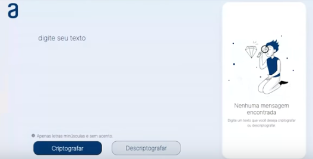

  

 Projeto Codificador do primeiro Challenge ONE🚀

[]<space><space>

## Overview

Decodificador de texto com Javascript

- **[Executar aplicação](https://)**

## License

MIT © [Saulo Emídio](https://github.com/sauloemidio)